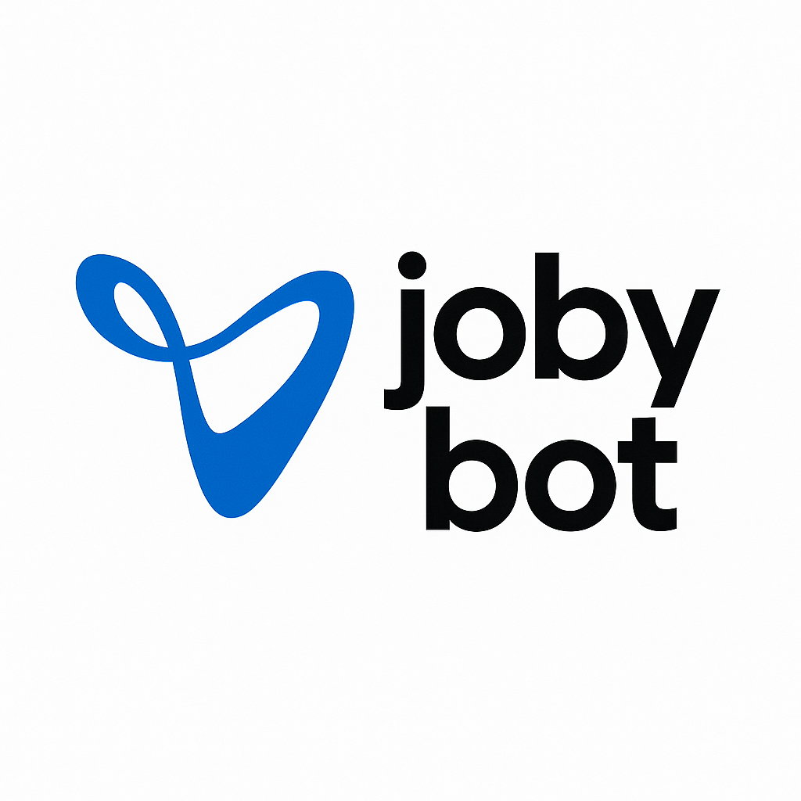

<div align="center">



# Jobybot: AI Desktop Agent

**An AI that has its own computer to complete tasks for you**

[](https://github.com/bytebot-ai/bytebot/tree/main/docker)


[🌐 Website](https://bytebot.ai) • [📚 Documentation](https://docs.bytebot.ai) • [💬 Discord](https://discord.com/invite/d9ewZkWPTP) • [𝕏 Twitter](https://x.com/bytebot_ai)

</div>
This is a an AI agent that was built from an open-source desktop agent named bytebot. We have extended it's capabilites to be improve it's usefulness as a working tool, and to enable the use of proprietary AI models, and on-premises AI models for greater security and privacy.


## What is a Desktop Agent?

A desktop agent is an AI that has its own computer. Unlike browser-only agents or traditional RPA tools, Jobybot comes with a full virtual desktop where it can:

- Use any application (browsers, email clients, office tools, IDEs)
- Download and organize files with its own file system
- Log into websites and applications using password managers
- Read and process documents, PDFs, and spreadsheets
- Complete complex multi-step workflows across different programs

Think of it as a virtual employee with their own computer who can see the screen, move the mouse, type on the keyboard, and complete tasks just like a human would.

## Why Give AI Its Own Computer?

When AI has access to a complete desktop environment, it unlocks capabilities that aren't possible with browser-only agents or API integrations:

### Complete Task Autonomy

Give Jobybot a task like "Download all invoices from our vendor portals and organize them into a folder" and it will:

- Open the browser
- Navigate to each portal
- Handle authentication (including 2FA via password managers)
- Download the files to its local file system
- Organize them into a folder

### Process Documents

Upload files directly to Jobybot's desktop and it can:

- Read entire PDFs into its context
- Extract data from complex documents
- Cross-reference information across multiple files
- Create new documents based on analysis
- Handle formats that APIs can't access

### Use Real Applications

Jobybot isn't limited to web interfaces. It can:

- Use desktop applications like text editors, VS Code, or email clients
- Run scripts and command-line tools
- Install new software as needed
- Configure applications for specific workflows

## Quick Start

### Deploy in 2 Minutes

**Option 1: Docker Compose**

```bash
git clone https://github.com/sunkencity999/familiarBot.git
cd familiarBot

# Add your AI provider key (choose one)
echo "ANTHROPIC_API_KEY=sk-ant-..." > docker/.env
# Or: echo "OPENAI_API_KEY=sk-..." > docker/.env
# Or: echo "GEMINI_API_KEY=..." > docker/.env

# Build the custom UI image with folder navigation fix
docker build -t familiarbot-ui-fixed:latest -f packages/bytebot-ui/Dockerfile packages/

# Start all services
docker-compose -f docker/docker-compose.yml up -d

# Open http://localhost:9992
```

[Full deployment guide →](https://docs.bytebot.ai/quickstart)

**Option 3: Local LLMs (LiteLLM + optional Ollama)**

Run Jobybot with a local LLM proxy and (optionally) Ollama:

```bash
git clone https://github.com/sunkencity999/familiarBot.git
cd familiarBot

# Start desktop, DB, agent, UI, and the LLM proxy (with optional Ollama)
docker compose -f docker/docker-compose.proxy.yml up -d

# Open http://localhost:9992 and select a model from the "proxy" provider,
# e.g., "ollama-llama3.1-8b" or "local-openai-compat".

# If using Ollama for the first time, pre-pull a model (optional):
docker exec -it bytebot-ollama ollama pull llama3.1:8b
```

## How It Works

Jobybot consists of four integrated components:

1. **Virtual Desktop**: A complete Ubuntu Linux environment with pre-installed applications
2. **AI Agent**: Understands your tasks and controls the desktop to complete them
3. **Task Interface**: Web UI where you create tasks and watch Bytebot work
4. **APIs**: REST endpoints for programmatic task creation and desktop control

### Key Features

- **Natural Language Tasks**: Just describe what you need done
- **File Uploads**: Drop files onto tasks for Bytebot to process
- **Live Desktop View**: Watch Bytebot work in real-time
- **Takeover Mode**: Take control when you need to help or configure something
- **Password Manager Support**: Install 1Password, Bitwarden, etc. for automatic authentication
- **Persistent Environment**: Install programs and they stay available for future tasks
- **File Explorer**: Browse, upload, download, create folders, and delete files under `/home/user` from the new Files page
- **Clipboard Sync**: Pull and push desktop clipboard text from the Files page

## Example Tasks

### Basic Examples

```
"Go to Wikipedia and create a summary of quantum computing"
"Research flights from NYC to London and create a comparison document"
"Take screenshots of the top 5 news websites"
```

### Document Processing

```
"Read the uploaded contracts.pdf and extract all payment terms and deadlines"
"Process these 5 invoice PDFs and create a summary report"
"Download and analyze the latest financial report and answer: What were the key risks mentioned?"
```

### Multi-Application Workflows

```
"Download last month's bank statements from our three banks and consolidate them"
"Check all our vendor portals for new invoices and create a summary report"
"Log into our CRM, export the customer list, and update records in the ERP system"
```

## Programmatic Control

### Create Tasks via API

```python
import requests

# Simple task
response = requests.post('http://localhost:9991/tasks', json={
    'description': 'Download the latest sales report and create a summary'
})

# Task with file upload
files = {'files': open('contracts.pdf', 'rb')}
response = requests.post('http://localhost:9991/tasks',
    data={'description': 'Review these contracts for important dates'},
    files=files
)
```

### Direct Desktop Control

```bash
# Take a screenshot
curl -X POST http://localhost:9990/computer-use \
  -H "Content-Type: application/json" \
  -d '{"action": "screenshot"}'

# Click at specific coordinates
curl -X POST http://localhost:9990/computer-use \
  -H "Content-Type: application/json" \
  -d '{"action": "click_mouse", "coordinate": [500, 300]}'
```

[Full API documentation →](https://docs.bytebot.ai/api-reference/introduction)

## Setting Up Your Desktop Agent

### 1. Deploy Jobybot

Use one of the deployment methods above to get Jobybot running.

### 2. Configure the Desktop

Use the Desktop tab in the UI to:

- Install additional programs you need
- Set up password managers for authentication
- Configure applications with your preferences
- Log into websites you want Jobybot to access

### 3. Start Giving Tasks

Create tasks in natural language and watch Jobybot complete them using the configured desktop.

## Use Cases

### Business Process Automation

- Invoice processing and data extraction
- Multi-system data synchronization
- Report generation from multiple sources
- Compliance checking across platforms

### Development & Testing

- Automated UI testing
- Cross-browser compatibility checks
- Documentation generation with screenshots
- Code deployment verification

### Research & Analysis

- Competitive analysis across websites
- Data gathering from multiple sources
- Document analysis and summarization
- Market research compilation

## Architecture

Jobybot is built with:

- **Desktop**: Ubuntu 22.04 with XFCE, Firefox, VS Code, and other tools
- **Agent**: NestJS service that coordinates AI and desktop actions
- **UI**: Next.js application for task management
- **AI Support**: Works with Anthropic Claude, OpenAI GPT, Google Gemini
- **Deployment**: Docker containers for easy self-hosting

## Why Self-Host?

- **Data Privacy**: Everything runs on your infrastructure
- **Full Control**: Customize the desktop environment as needed
- **No Limits**: Use your own AI API keys without platform restrictions
- **Flexibility**: Install any software, access any systems

## Advanced Features

### Multiple AI Providers

Use any AI provider through our [LiteLLM integration](https://docs.bytebot.ai/deployment/litellm):

- Azure OpenAI
- AWS Bedrock
- Local models via Ollama
- 100+ other providers

### Local LLMs via LiteLLM

Jobybot includes a proxy setup powered by LiteLLM that lets you use:

- Ollama models locally (e.g., `llama3.1:8b`), via the bundled `bytebot-ollama` service
- Any OpenAI-compatible FastAPI endpoint by pointing `LOCAL_OPENAI_BASE` to your server

Files to know:

- `docker/docker-compose.proxy.yml`: brings up `bytebot-llm-proxy` and (optionally) `bytebot-ollama`
- `packages/bytebot-llm-proxy/litellm-config.yaml`: models exposed via the proxy

Environment variables:

- `BYTEBOT_LLM_PROXY_URL`: set for the agent to fetch models and route completions (defaults to `http://bytebot-llm-proxy:4000` in the proxy compose file)
- `OLLAMA_BASE_URL`: base URL for Ollama (defaults to `http://bytebot-ollama:11434`)
- `LOCAL_OPENAI_BASE`: base URL of an OpenAI-compatible endpoint (e.g., FastAPI `/v1`)
- `LOCAL_OPENAI_API_KEY`: optional API key for your local endpoint

Once running, open the UI and pick a model under the provider `proxy` (e.g., `ollama-llama3.1-8b` or `local-openai-compat`).


## Community & Support

- **Discord**: [Join our community](https://discord.com/invite/d9ewZkWPTP) for help and discussions
- **Documentation**: Comprehensive guides at [docs.bytebot.ai](https://docs.bytebot.ai)
- **GitHub Issues**: Report bugs and request features

## Contributing

We welcome contributions! Whether it's:

- 🐛 Bug fixes
- ✨ New features
- 📚 Documentation improvements
- 🌐 Translations

Please:

1. Check existing [issues](https://github.com/sunkencity999/familiarBot/issues) first
2. Open an issue to discuss major changes
3. Submit PRs with clear descriptions


## License

Jobybot is under the MIT license.

---

<div align="center">

**Give your AI its own computer. See what it can do.**

[](https://railway.com/deploy/bytebot?referralCode=L9lKXQ)

<sub>Built by [Tantl Labs](https://tantl.com), Christopher Bradford (internally) and the open source community</sub>

</div>
